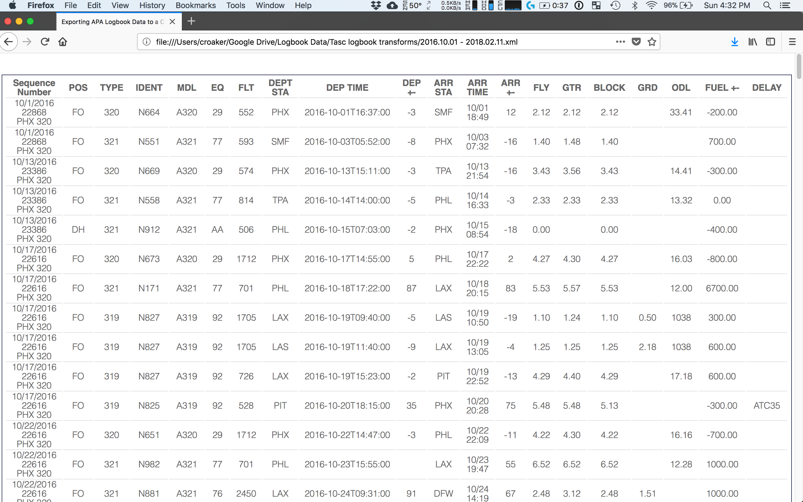

# AA_Logbook_Export

Exports American Airlines logbook data to a more useable format. The XSLT version of this script works but is not currently being developed. Use the python version for the latest features.

## Python script instructions

Requires python >= 3.7

[Example output](https://github.com/DonalChilde/AA_Logbook_Export/tree/master/example_data)

translated_log.csv is the default output, and the one most people would use.

### To download your logbook in XML format

First, try the direct link to [Sabre](https://tasc.alliedpilots.org/Sabre/SabreLogin.aspx) and go to step 5. If that doesn't work, follow all the steps below.

1. Go to the [APA website](https://www.alliedpilots.org) and log in.
1. Click `3XP / PBS Awards / Scheduling` under Quick Links
1. Click `PBS Awards & 3XP`.
1. Click on the `Sabre` link in the top right corner.
1. In Sabre, Under the `Go To` dropdown in the top right corner, select `Logbook`.
1. Click the harddrive icon with a bent arrow coming out of the top to export. Choose XML file format and save the file to a location that is easy to find later. The downloaded file should look like `myCrystalReportViewer.xml`. Feel free to rename this, but keep the `.xml` ending.

### Usage Instructions

To export in the default format (translated.csv):  

`aaLogbookExport export <path to input file> <path to output file>`

To export in one of the other supported formats:

`aaLogbookExport export -e rawcsv <path to input file> <path to output file>`  

Get help:

`aaLogbookExport export --help`

Note: Instructions on how to install a python source package are outside the scope of this guide. But it is not hard, Google is your friend ;). Make sure you have Python 3.7 or better installed, and consider using pipenv and a virtual environment.

## XSLT Instructions

### Note XSLT version works, but future development will be on the Python version

### Before you download your schedule

1. Install the Firefox web browser. Due to other browser’s security settings, only Firefox will do a local transform. The others require that you use a webpage from a web server to do this kind of thing. I might get to that later.  

   See: [Can Chrome be made to perform an XSL transform on a local file?
](https://stackoverflow.com/questions/3828898/can-chrome-be-made-to-perform-an-xsl-transform-on-a-local-file?rq=1)
2. Copy the file "TASC_Logbook_To_csv.xsl" to a folder where you will be keeping your downloaded logbook.XML.

### To download your logbook in XML format

1. Go to the [APA website](https://www.alliedpilots.org)
1. Click [3XP / PBS Awards / Scheduling](https://www.alliedpilots.org/Committees/Scheduling) under Quick Links
1. Click [PBS Awards & 3XP](https://oac.alliedpilots.org/).
1. Click on the [Sabre](https://tasc.alliedpilots.org/Sabre/SabreLogin.aspx) link in the top right corner.
1. In Sabre, Under the `Go To` dropdown in the top right corner, select `Logbook`.
1. Click the harddrive icon with a bent arrow coming out of the top to export. Choose XML file format. Make sure you save the file to the same folder as your copy of “TASC_Logbook_To_csv.xsl”

### To ready your logbook for export

1. Open the downloaded XML file with a text editor. On Windows I recommend Visual Studio Code or NotePad++, both free text editors. Visual Studio Code also works on OSX. If you run Linux, I assume you don't need any suggestions ;)

1. Add the line  

   ```xml
   <?xml-stylesheet type = "text/xsl" href = "TASC_Logbook_To_csv.xsl"?>
   ```  

   so that the first two lines look like:  

   ```xml
   <?xml version="1.0" encoding="utf-8"?>
   <?xml-stylesheet type = "text/xsl" href = "TASC_Logbook_To_csv.xsl"?>
   ```

1. Change the Crystal report tag (usually line 3) from this:

   ```xml
   <CrystalReport xmlns="urn:crystal-reports:schemas:report-detail" xmlns:xsi="http://www.w3.org/2001/XMLSchema-instance" xsi:schemaLocation="urn:crystal-reports:schemas:report-detail http://www.businessobjects.com/products/xml/CR2008Schema.xsd">
   ```

1. To this:

   ```xml
   <CrystalReport>
   ```

   For some reason the extra attributes in the `<CrystalReport>` tag cause the page do not render. I don’t know why.

   When you are done, the first three lines should look like this:

   ```xml
   <?xml version="1.0" encoding="utf-8"?>
   <?xml-stylesheet type = "text/xsl" href = "TASC_Logbook_To_csv.xsl"?>
   <CrystalReport>
   ```

1. Save the changes, and open your downloaded logbook.XML file in Firefox.

You should see something like this:



At the bottom of the page is a link to convert and save your logbook in CSV format, suitable for importing into any spreadsheet program.
Alternatively, if you copy the table from the webpage, you can paste it into Google Sheets.

Notes:

- There is still some work to be done with the duration fields, Splitting the info in the Sequence Number field, and working out a better arrival time field.
- Some of the other export formats I tried (PDF, CSV) gave me incorrect data, like a 2+30 leg to Miami when the flight actually took close to 5 hours. I have not found any errors in the XML format export, except for a missing equipment code on one model of the 321. The ETOPS ones I think. Doing some spot checking would be a good idea.
- Windows uses a different hidden character from the one used in webpages to signify the end of a line. Using a slightly more advanced text editor – like Visual Studio Code -  will help keep you from mixing line endings if you edit the XML file on a windows machine. Plus Visual Studio Code is just better than the Notepad that comes with Windows.
- I lifted the CSV code from the internet, many thanks to the guy who figured that one out. See: [Exporting data from a web browser to a csv file using javascript.](https://adilapapaya.wordpress.com/2013/11/15/exporting-data-from-a-web-browser-to-a-csv-file-using-javascript/)

Let me know how this works out for you, and feel free to share. If you make improvements, let me know so I can merge them in to the master copy.

Chad Lowe – LAX Base